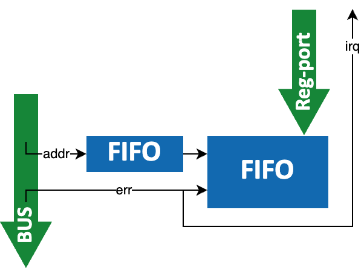

# UNBENT: Universal Non-intrusive Bus Error Notification & Tracking

This bus_err_unit IP handles bus errors. It is developed as part of the PULP project, a joint effort between ETH Zurich and the University of Bologna.

It stores the error source address into a register and translates the error signal to an interrupt for the cores. The bus signals are not modified and only passed into the unit. Below is a rough block-diagram of the implemented functionality.

## Protocol Wrappers:
Dedicated wrappers exist for the following protocols.
- [AXI](https://github.com/pulp-platform/axi) (`axi_err_unit_wrap`)
- [OBI](https://github.com/pulp-platform/obi) (`obi_err_unit_wrap`)

## License
All hardware sources and tool scripts are licensed under the Solderpad Hardware License 0.51 (see [LICENSE](LICENSE)).
